Что и как изучает история Средних веков.
========================================

----

Как назывался период который вы изучали в прошлом году?
Что вам больше всего запомнилось из курса прошлого года?

----

Средние века
============

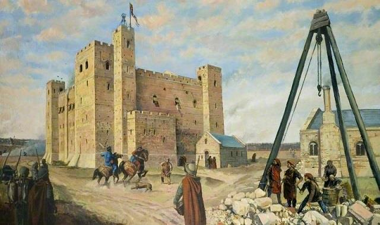

----

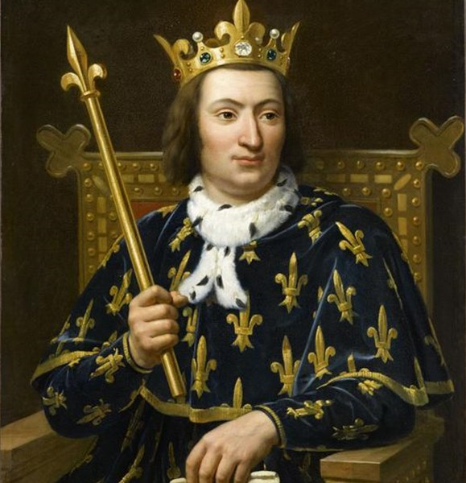

----

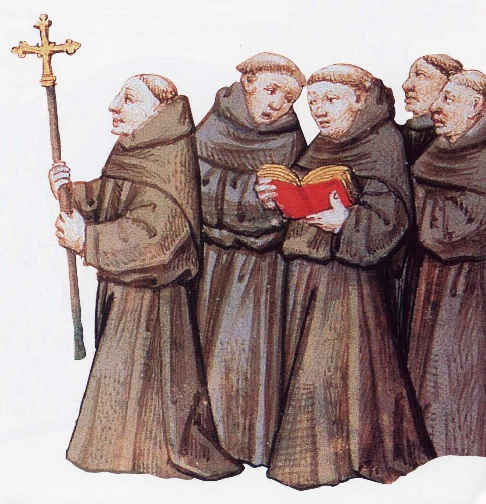

----

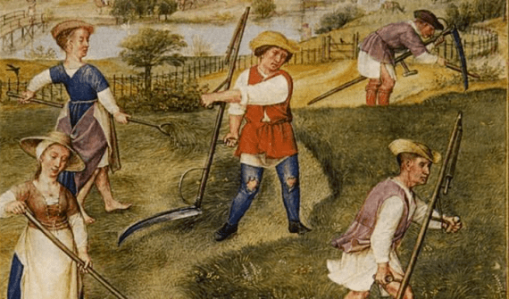

----

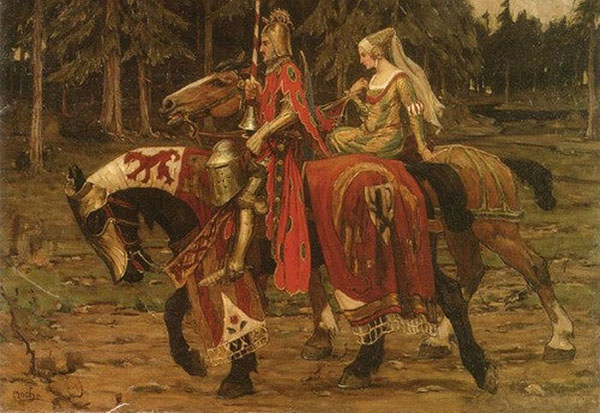

----

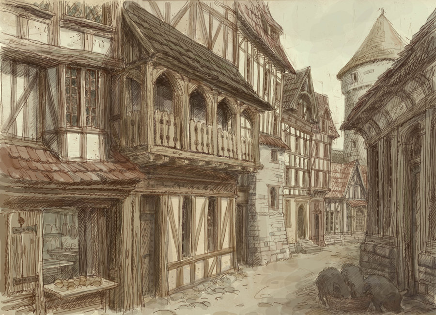

----

Название и периодизация средних веков.
======================================

Падение Рима. 476г
Конец XV-середина XVII века

----

Периодизация средневековья
==========================

* Раннее средневековье V-XI века.
* Зрелое Средневековье XII-XIV века.
* Позднее Средневековье XIV-XV века.

----

Представление средневекового человека о прошлом.
================================================

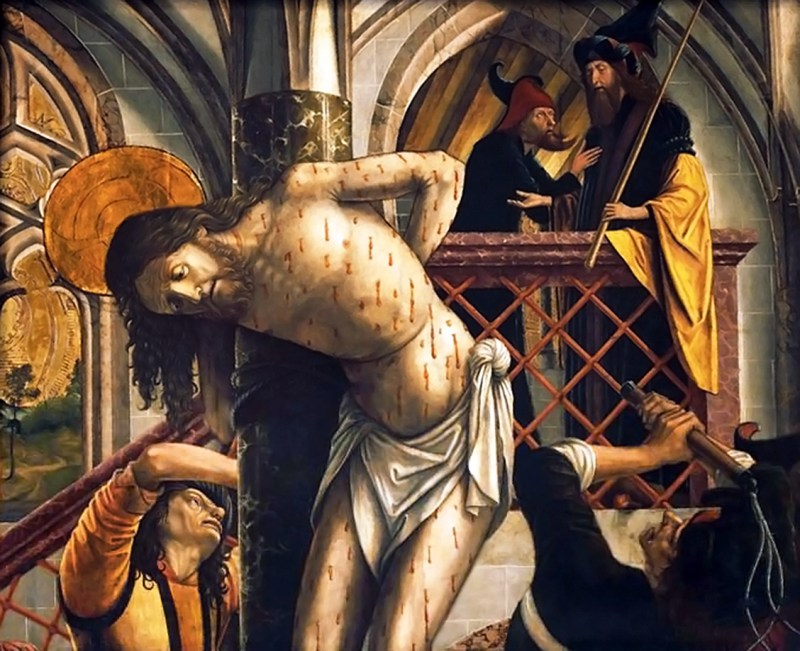

----

Представление о будущем.
========================

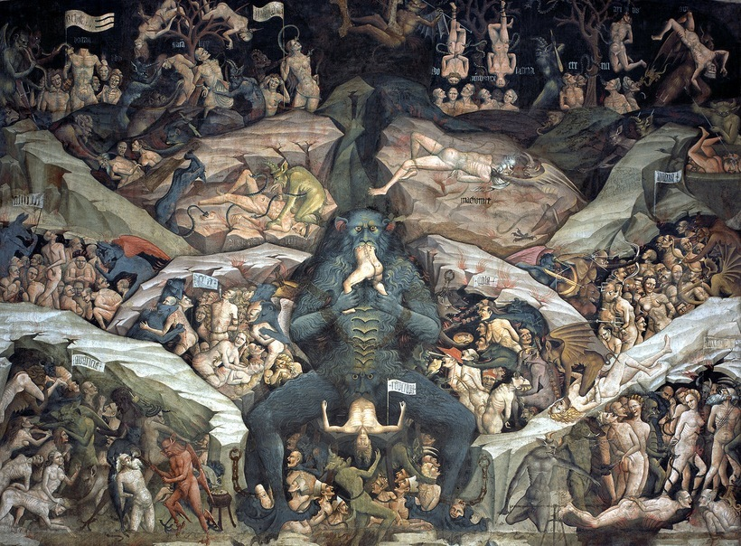

----

Вклад средневековья в мировую культуру
======================================

Литература
* «Песнь о Роланде» 
* «Песнь о нибелунгах»
* «Божественная комедия» 
* «Смерть Артура»

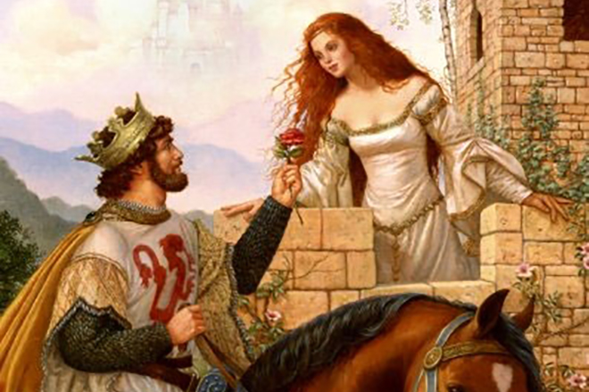

----

Архитектура
===========

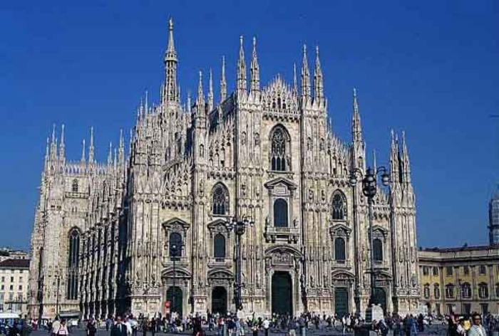

----

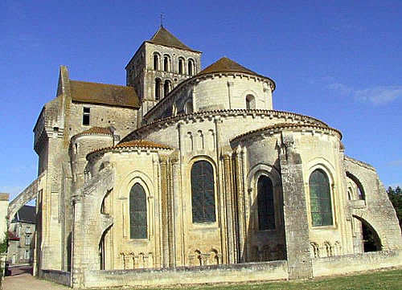

----

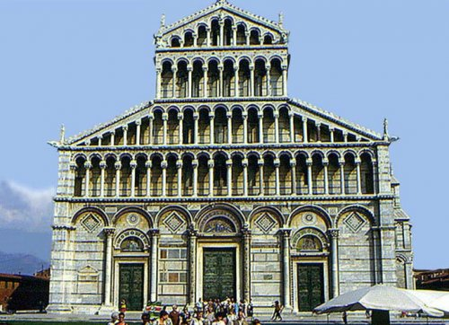

----

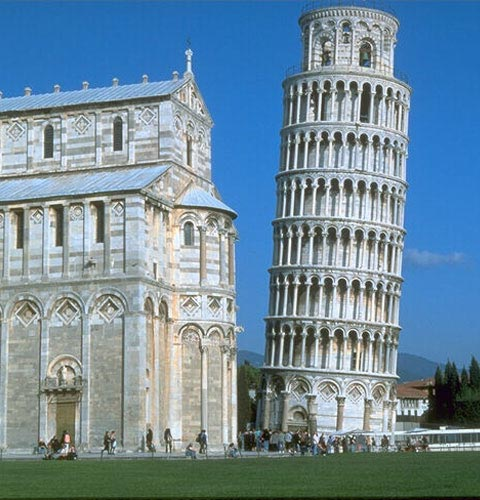

----

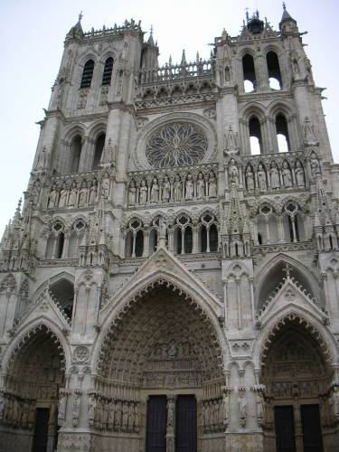

----

Живопись
========

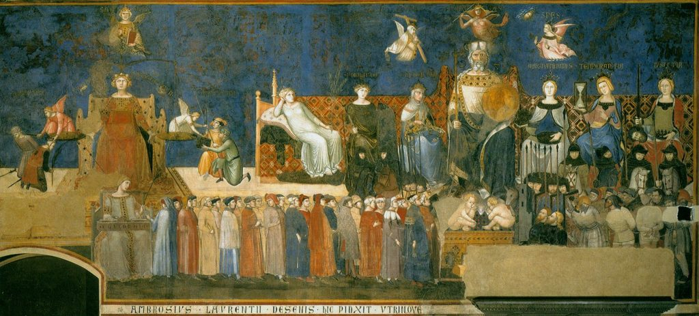

----

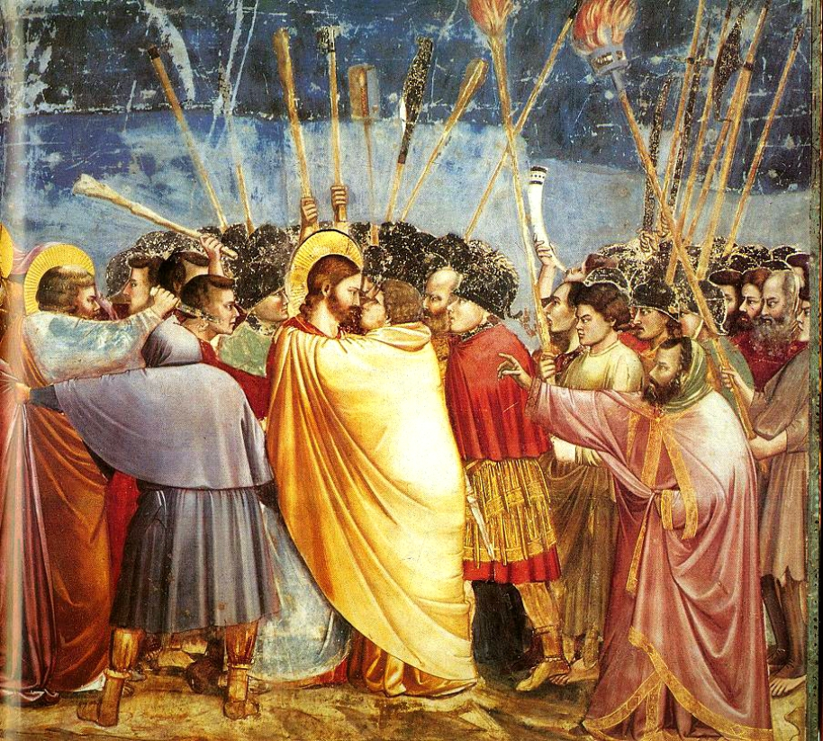

----

Книги средневековья
===================

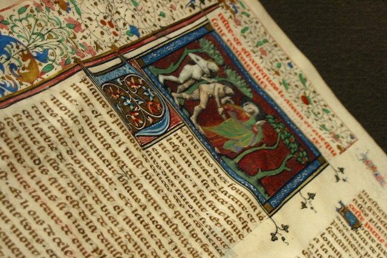

----

Откуда мы знаем об истории средних веков?
=========================================

Исторический источник — продукт человеческой деятельности, используемый для получения данных о человеке и обществе, в котором тот жил и действовал.

----

Письменные источники
====================

* Законы
* Документы
* Литературные произведения
* Летописи
* Мемуары

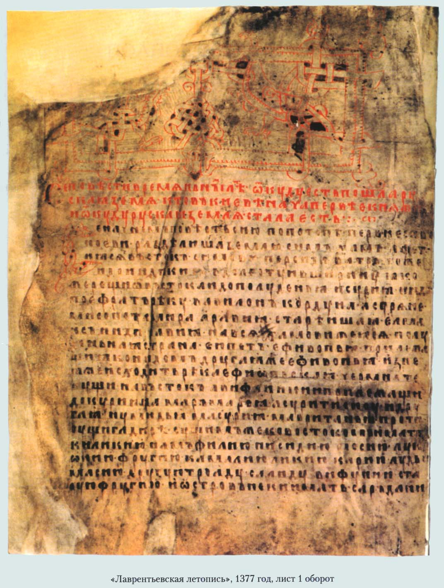

----

Изобразительные источники
=========================

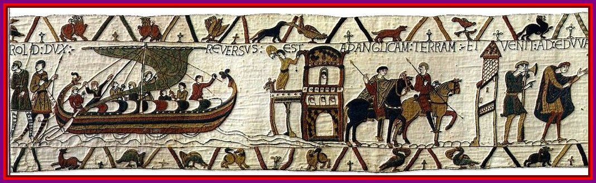

----

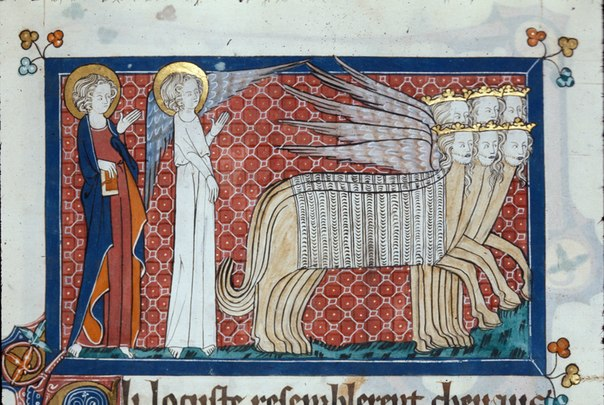

----

Вещественные источники
======================

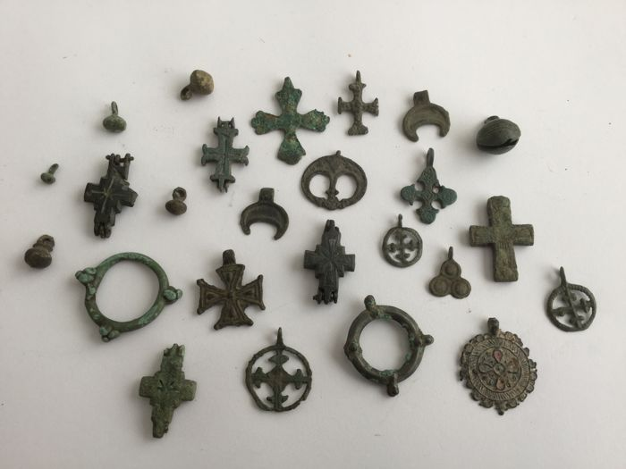

----

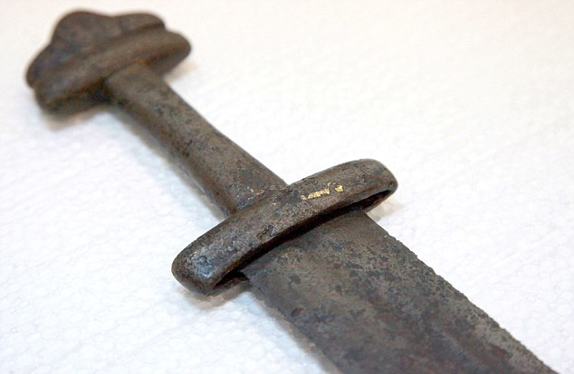

----

Домашнее задание
================

Сочинение "Мое представление о средних веках"

----
