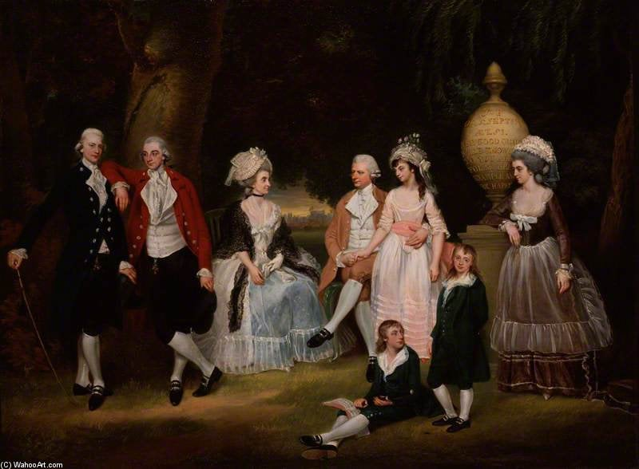
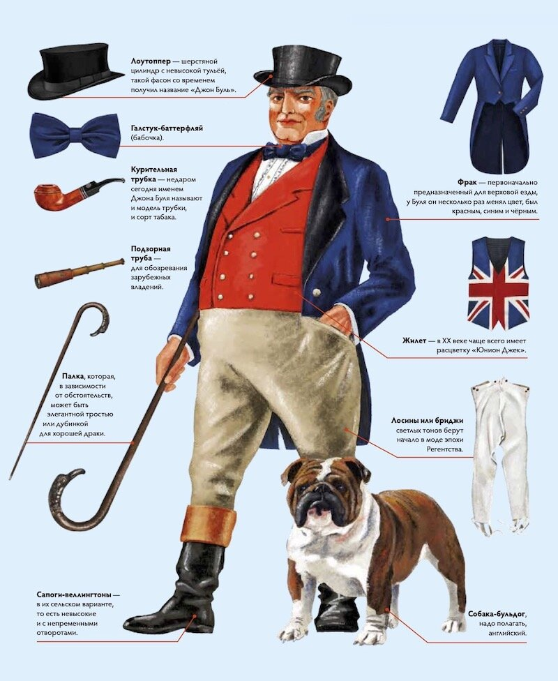
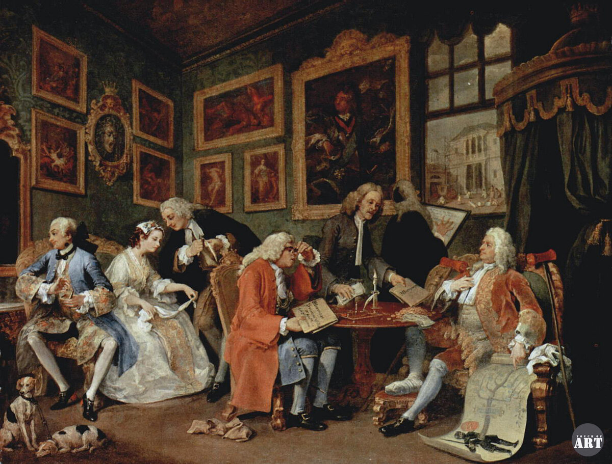

========================
Общество старого порядка
========================

----

XVIII век
---------
Появляется новый объединяющий фактор **Национальная самосознание**. Формируются нации.

----

Нация
-----

Историческая общность объединенная языком, культурой и историей.

----

Становление английской нации.
-----------------------------

1. Столетния война и противостояние французам.
2. Возникновение англиканской церкви.

----

Джонн Буль
----------

----

Франция
-------

Основные ценности родина и государство. Формирование гражданственности. Идеи равенства и естественных прав появляются в 19 веке.

Франция была центром европейской культуры и в ее распространении видела свою миссию.

В 1789 году Э. Ж. Сийес выразил мысль что именно 3 сословие является французской начей так как тольно он приносит пользу. Нация в его представлении свободный народ, который обладает суверенитетом.

----

Италия
------

1. Не была единой. Национальное самосознание было отражено лишь в работах философов.
2. Считали себя наследниками Древнего Рима.
3. Считали себя родоначальниками высокой культуры.
4. Формировалась идея объединение Италии вокруг Рима.

----

Германия (Священая Римская Империя)
-----------------------------------

1. Не было политического центра. Раздробленные территории.
2. Не было религиозного и культурного единства.
3. Но была общая история, восходящая к древним германцам и общий язык.

----

Космополитизм
-------------

Идеология, которая рассматривает людей как граждан мира. Акцент на общечеловеческих интересах.

----

Изменение сословий
------------------

1. **Духовенство**. Разрыв между простыми священниками и высшими иерархами растет.
2. **Дворянство**. Приход капитализма заставляет их беднеть. Часть знати включается в предпринимательскую деятельность. Многие дворяни интересовались идеями просвещения. 
3. **Третье сословие**. Рост численности буржуазии. Она постепенно богатеет.Постепенно сливается с дворянством. В среде крестьянсва происходило расслоение. Растет доля городских низов.

----

У. Хогард. Модный брак.
-----------------------

----

Средний возраст брака довольно высокий 25-29 лет. Исключение буржуазия и дворяне 18-21 год.

Часто на первое место вставали не чувства а денежные вопросы. 

Брак был социальной нормой, а безбрачие редкостью.

Было четкое распределение ролей.

----

Рождаемость была высокой. Но и была высокая детская смертность. В среднем в семье было 5-10 детей. 

Состоятельные люди нередко после рождения отдавали ребенка кормилице. 

Дети крестьян и ремесленников рано включались в работу.

Появляются детские книги, растет количество детских игрушек.
