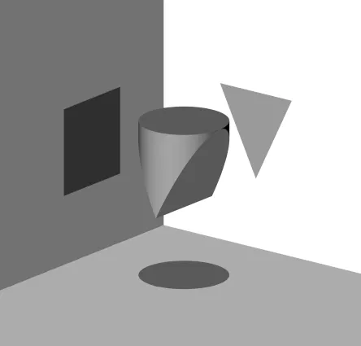
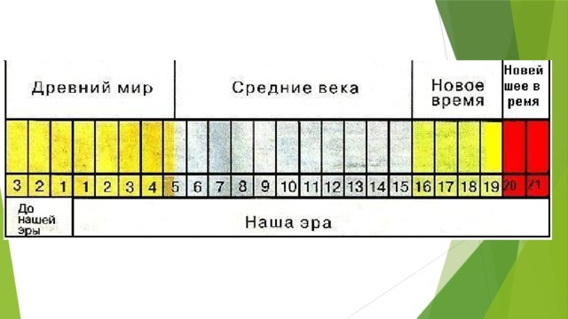

Введение в историю
==================

----

Что такое история?
==================

* Для чего нам нужно изучать историю?
* История это наука?

------------------------------

На какие группы делятся науки?
==============================

------------------------------

Предмет и Объект
================

----

Как историки узнают о том что было в прошлом?
=============================================

----

Источники
=========

1. Письменные (но туда не входят эпиграфические источники: надписи на камнях, берестяные грамоты и т.п.).
2. Вещественные (археологические).
3. Устные источники.
4. Данные языка.
5. Этнографические (явления культурной и общественной жизни).
6. Кинофотодокументы.
7. Фонодокументы.

----

* Источники
* Исследования
* Пособия

----

ИСТОРИЧЕСКИЙ ФАКТ — это действительное событие, имевшее место и обладающее всегда следующими характеристиками: локализованностью во времени и пространстве, объективностью и неисчерпаемостью.
ИСТОРИЧЕСКИЙ ПРОЦЕСС - закономерное и последовательно чередование явлений.

----

Субъект истории
===============

----

Общество
========

1. определённая совокупность людей, объединившихся для общения и совместного выполнения какой-либо деятельности (например, общество филателистов, общество охраны природы);
2. конкретный этап в историческом развитии народа или страны (например, феодальное общество);
3. отдельное конкретное общество, страна, государство, регион (например, современное российское общество).

----

Цивилизация
===========

локализованное во времени и пространстве общество. Локальные цивилизации являются целостными системами, представляющими собой комплексы экономической, политической, социальной и духовной подсистем, и развивающиеся по законам витальных циклов

----

Народ
=====

----

Государство
===========

политическая форма организации общества на определённой территории, суверенная организация публичной власти

----

Этнос
=====

Исторически сложившаяся общность людей (племя, народность, нация), имеющая социальную целостность и своеобразно-индивидуальный стереотип поведения.

----

Нация
=====

Исторически сложившаяся устойчивая общность людей, возникшая на базе общности языка, территории, экономической жизни и психического склада, проявляющегося в общности культуры.

----

Историческое время
==================

----

Эволюционный и революционный подходы в истории.
===============================================

----

Исторические теории
===================

----

Марксистский подход
===================

----

Цивилизационный подход
======================

----

Школа «Анна́лов» 
===============

Новое, расширенное понимание исторического источника, который стал теперь трактоваться как «всё, что человек говорит или пишет, всё, что он изготовляет, всё, к чему он прикасается»;
Новый метод работы с источником, путём постановки ему вопросов и проникновения в его идейную подоплёку. Стремление углубиться в источник и понять его «изнутри» поставило вопрос о мировоззрении людей, оставивших нам тот или иной источник, и ввело в научный оборот историков слово «менталитет».

----

Домашнее задание
================

Подготовить рассказ о псевдоисторической теории.

1. Об авторе.
2. Содержание теории.
3. Научная критика.

----
