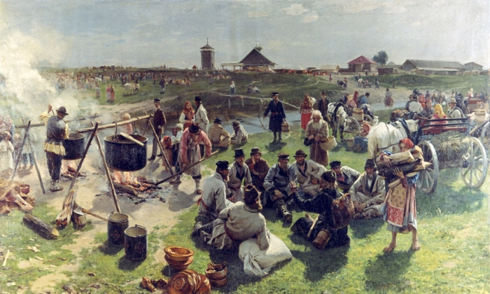
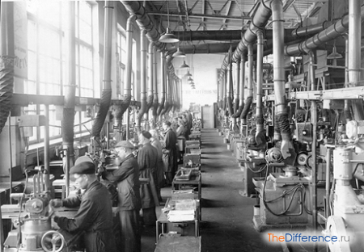
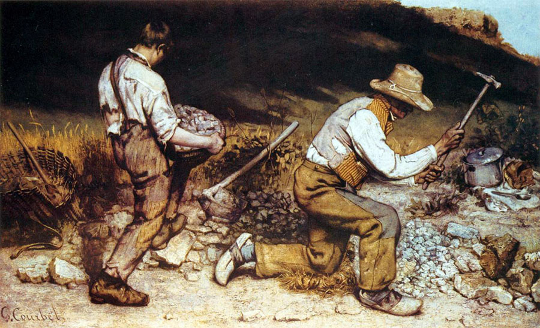
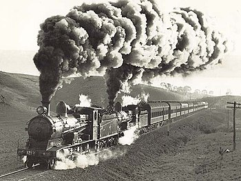
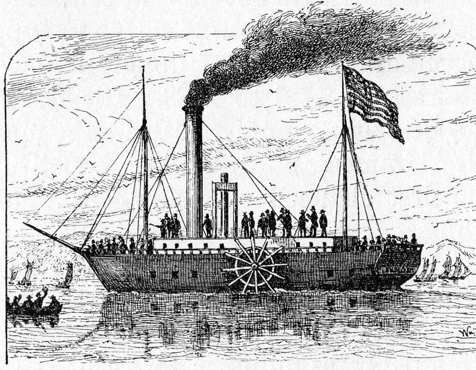
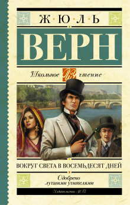

Жизнь в XIX веке
================

----

Какие важнейшие исторические события вы помните из истории 8 класса?
====================================================================

----

Традиционная культура
=====================

----

Индустриальное общество
=======================

----

Социальные изменения
====================

* Урбанизация
* Возникновение новых классов
* Повышение мобильности населения

----

Политические изменения
======================

* Демократизация
* Возникновение идеологий
* Возникновение правового государства

----

Культура
========

* Светский характер
* Появление реализма

----

Появилось больше исторических источников
========================================

----

“Долгий XIX век”
================

----

Экономика XIX века
==================

----

Промышленная революция
======================

.. image:: ./img/4.jpg

----

Даже странно подумать, что раньше
Каждый шел, как хотел - а теперь,
Паровоз, как мессия, несет нас вперед
По пути из Калинина в Тверь.

----

Транспортная революция 
======================

----

Пароход Фултона 1807 г
======================

----

----

Развитие капитализма
====================

Акционерные общества
Капитал можно было получить из банковского кредита
Появление заводов
Стандартизация
Усиление разделения труда

----

Неравномерность экономического развития
=======================================

Смена экстенсивного роста интенсивным
Международная, региональная и отраслевая неравномерность развития

----

Кризисы
=======

Старого типа
Нового типа(перепроизводство)

----

Монополии
=========

Картели, синдикаты, тресты

----

Сельское хозяйство
==================

Отмена сеньориальной системы и рабства
Увеличение производительности

----

Развитие торговли
=================

----

Подготовить рассказ об одном из выдающихся деятелей XIX века.
=============================================================

----
